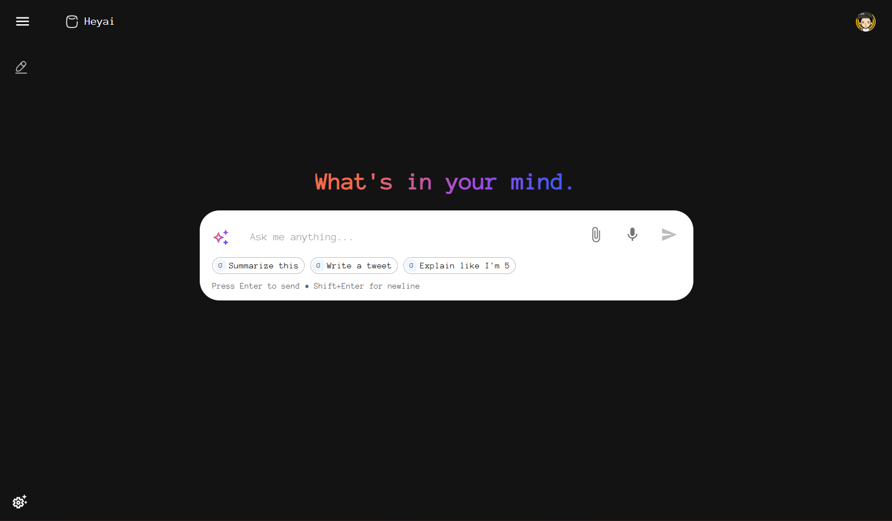

# HeyAI — Intelligent Chatbot Application

**HeyAI** is a personalized AI chatbot application developed to demonstrate end-to-end product development skills across frontend, backend, databases, and AI model integration.
The system allows authenticated users to interact with an AI model, store conversations, and receive intelligent responses powered by Google Gemini via LangChain.

 

# 🖥️ Screenshots

 

# 🧠 Key Features

- AI Chat System powered by LangChain + Google Gemini-
- Secure Authentication using Clerk
- Persistent Conversations stored in PostgreSQL
- Full-Stack Architecture (React frontend + Node.js/Express backend)
- Database Modeling & ORM using Prisma
- Modern, Responsive User Interface
- Designed for scalability, modularity, and clean code organization

 

# 🛠️ Technology Stack

### Frontend
- React
- React Router Dom
- Clerk 
- React Markdown
- Material UI

### Backend
- Node.js
- Express
- LangChain
- Clerk
- Zod
- Google Gemini API

### Database
- PostgreSQL
- Prisma ORM
